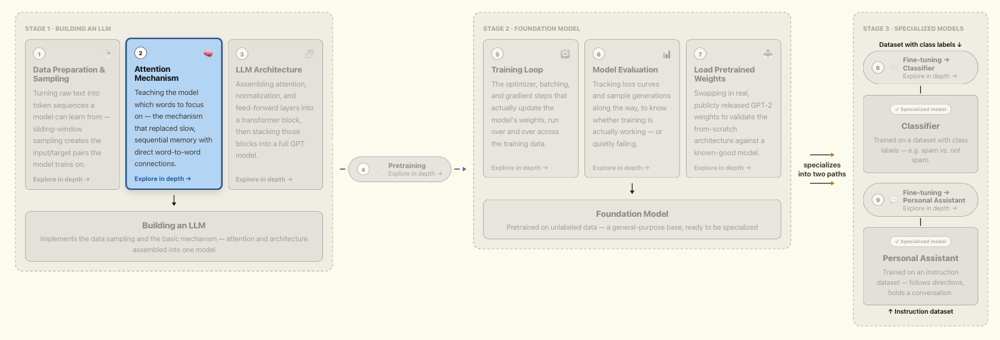

# LLM From Scratch

Building a working, from-scratch understanding of how LLMs are architected, pretrained, and finetuned — following a self-directed 35-day engineering plan, in service of strengthening a Senior Data Scientist candidacy and building visible LLM engineering expertise.

## Goal

Scope is deliberately trimmed to what directly serves that goal: tokenization, attention, GPT architecture, pretraining, and finetuning (classification + instruction, including LoRA) — built from scratch rather than only read about, so the understanding transfers to real engineering work.

## Plan Structure

| Phase | Focus |
|---|---|
| 1. NN Foundations | Neural net fundamentals before touching transformer code |
| 2. Text Data & Embeddings | Tokenizer, dataloader, embeddings — from scratch |
| 3. Attention & GPT Architecture | Attention mechanism through full GPT model assembly |
| 4. Pretraining & Finetuning | Train a GPT, load GPT-2 weights, finetune (classification + instructions), LoRA |
| 5. Capstone | Demo app, repo polish, technical write-up, 90-day roadmap |

## Current Status

**Phase 1 — Neural Network Foundations: Completed ✅**
**Phase 2 — Text Data & Embeddings: Completed ✅**
**Phase 3 — Attention & GPT Architecture: In Progress 🔄 (attention mechanisms complete)**

## Phase 1 — Neural Network Foundations

Covers the neuron computation, architecture design, weight initialization, activation functions, forward propagation, loss functions, backpropagation, optimizers, dropout, and training loop — the full sequential design process below, then applied hands-on to a real dataset (`Foundation_Concepts/Neural Network Foundation/`) building both a classification and a regression network.


## Phase 2 — Text Data & Embeddings

Covers tokenization from scratch through to model-ready batches: byte-pair encoding with `tiktoken`, a sliding-window `Dataset` that turns raw text into input/target token sequences, and a `DataLoader` for batching — built and exercised hands-on in `Foundation_Concepts/LLM_Design_Stage_1/`.


## Phase 3 — Attention & GPT Architecture

In progress. Covers the attention mechanism from first principles: simplified self-attention, self-attention with trainable query/key/value weights, causal (masked) attention with dropout, and multi-head attention (both the simple parallel-heads wrapper and the more efficient single-weight-matrix implementation) — built and exercised hands-on in `Foundation_Concepts/LLM_Design_Stage_1/`.



## Primary Resources

- Sebastian Raschka — *Build a Large Language Model (From Scratch)* ([github.com/rasbt/LLMs-from-scratch](https://github.com/rasbt/LLMs-from-scratch)) — primary spine for tokenization, attention, GPT architecture, pretraining, finetuning, and LoRA
- Josh Starmer — *StatQuest Illustrated Guide to Neural Networks and AI* ([github.com/StatQuest/signa](https://github.com/StatQuest/signa)) — foundational neural network intuition
- Krish Naik — Udemy courses

## Repo Structure

```
.
├── Foundation_Concepts/
│   ├── Neural Network Foundation/
│   │   ├── neural_network_design_pocket_reference.md   # sequential 10-step design reference
│   │   ├── 01_classification_churn.ipynb               # classification NN, built section-by-section
│   │   ├── Churn_Modelling.csv                          # dataset used for Phase 1 exercises
│   │   └── Neural_Network_Design_Process_Overview.png
│   └── LLM_Design_Stage_1/
│       ├── Data_Prepration.py                           # tokenizer, sliding-window dataset, dataloader
│       ├── Attention_Mechanism.py                       # self-attention, causal attention, multi-head attention
│       ├── the-verdict.txt                              # sample text used for Phase 2 exercises
│       ├── Stage1_ Step1_DataPrep.png
│       ├── Stage1_Step2_Attention_Mechanism.png
│       └── Misc/                                        # earlier tokenizer exploration scripts
├── pyproject.toml
├── main.py
└── README.md
```
